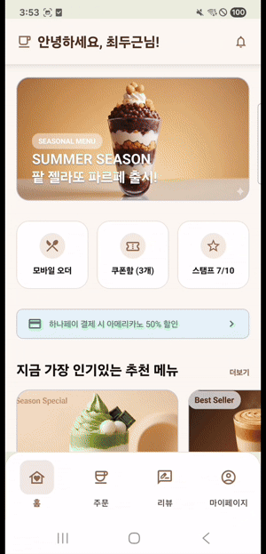
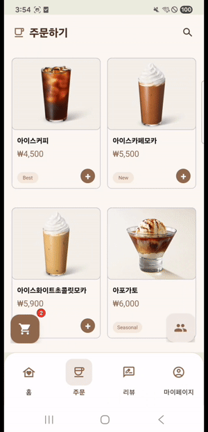
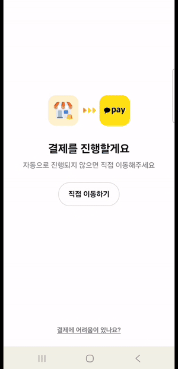
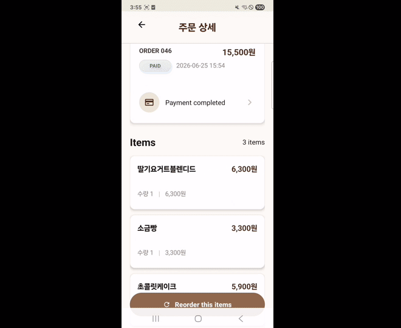
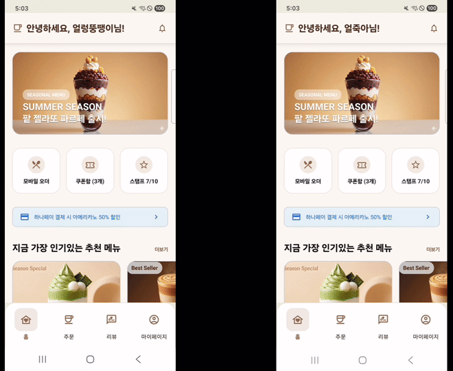
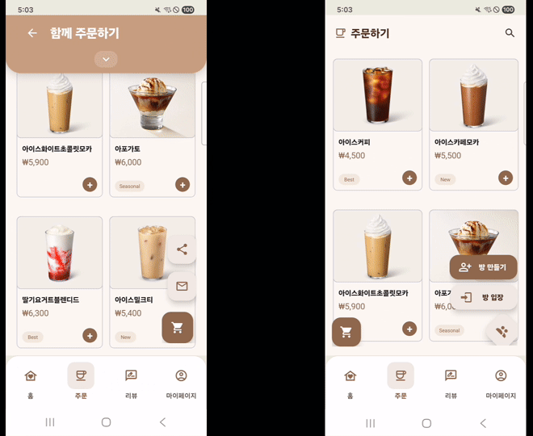
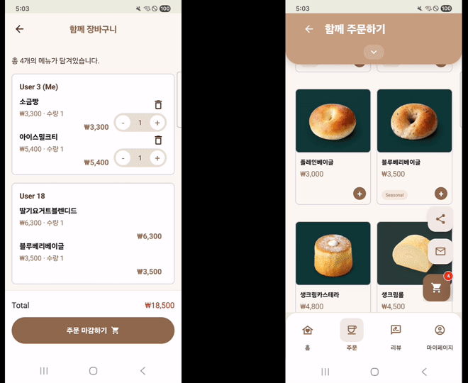
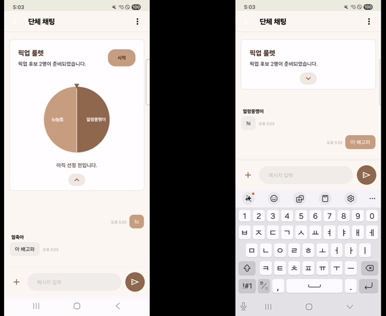
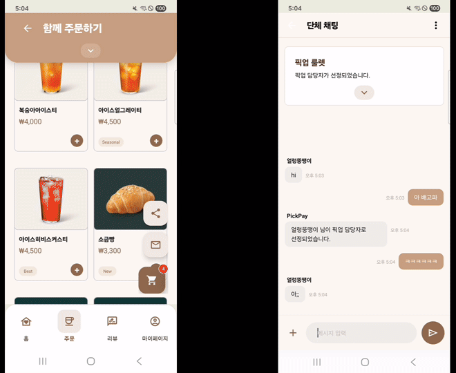
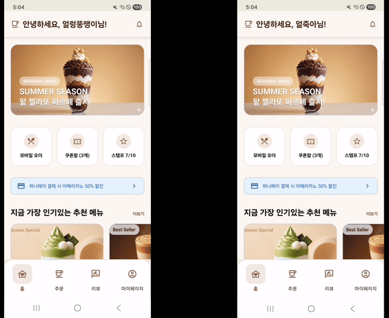

# PickPay

카페 메뉴 주문부터 공동 장바구니, 채팅, 결제, 리뷰까지 연결하는 Android + Spring Boot 기반 주문 서비스입니다.

실행 방법, 환경 변수, 기술 스택과 API 목록은 [실행환경 및 API](실행환경및API.md)를 참고하세요.

## 기능별 시연

제공된 시연 영상을 기능별로 편집했습니다. GIF는 1.5배속으로 반복 재생됩니다. 공동 주문 장면은 두 기기의 화면을 함께 보여줍니다.

### 로그인

계정으로 로그인해 메뉴와 주문 서비스를 이용합니다.

### 리뷰 · AI 분석

리뷰 사진과 내용을 확인하고 AI 메뉴 분석 및 질의응답을 이용합니다.

### NFC · 개인 장바구니

NFC로 메뉴를 스캔하고 장바구니에서 수량과 주문 금액을 확인합니다.

### 개인 주문 영수증

개인 결제 완료 후 영수증과 주문한 메뉴 내역을 확인합니다.

### 회원가입

새 계정을 만들고 각 기기에서 로그인합니다.

### 공동 주문방 · 초대

공동 주문방을 만들고 초대 링크를 공유해 함께 주문합니다.

### 실시간 공동 장바구니

참여자가 추가한 메뉴와 수량을 공동 장바구니에서 실시간으로 확인합니다.

### 그룹 채팅

주문방 참여자와 실시간 메시지를 주고받습니다.

### 픽업 담당자 룰렛

룰렛으로 픽업 담당자를 정하고 결과를 참여자에게 공유합니다.

### 분할 결제

각 참여자의 주문 금액을 확인하고 결제 화면에서 개별 결제를 진행합니다.

### 그룹 주문 영수증

그룹 결제 결과와 참여자별 주문 내역을 확인합니다.

## 프로젝트 구성

- `payclient/`: Kotlin 기반 Android 앱
- `paymanagement/`: Spring Boot 백엔드
- [실행환경및API.md](실행환경및API.md): 실행 환경, 설정 및 API 문서
- `docs/images/`: 기능별 시연 GIF
- [GIF 생성 스크립트](docs/scripts/make_demo_gifs.py): 원본 영상에서 같은 구간을 다시 추출하는 도구(FFmpeg 필요)
